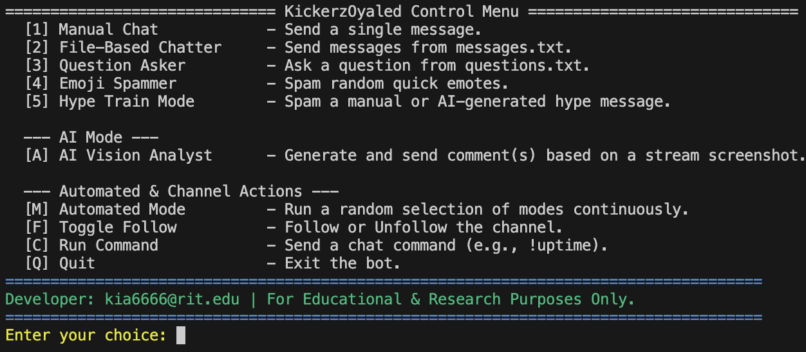

# KickerzOyaled & Toolkit 🦎

A suite of high-performance, asynchronous tools designed for educational and research purposes related to the Kick streaming platform. This repository is home to **KickerzOyaled**, an interactive, AI-powered chat bot, alongside utilities for generating live/VOD views and creating accounts.

[](https://www.python.org/downloads/)
[](https://opensource.org/licenses/MIT)

---

### Support The Project

This project is developed and maintained in my free time. If you find these tools useful and wish to support their continued development, please consider donating.

All donations go directly towards funding the resources needed for testing, ice-cream and research, such as dedicated servers and residential proxy plans. Your support helps me go crazy with new ideas and push the boundaries of what's possible.

**Monero (XMR) Address:**
```
4362JdtPhfAZbpu95Z2EeJ2fNVsRaxJ8z7sYCsN724z1iLCKMymyDiTTqeqf4p5qnzYE7TifzXkusSiWFr7qykDU7Bv55as
```
---

> [!WARNING]
> **Disclaimer**: This script is intended for educational and research purposes only. The developer is not responsible for any misuse of this software. By using this script, you agree to use it legally and ethically.

## Featured Tool: KickerzOyaled (AI Chat Bot)

**KickerzOyaled** is an advanced, interactive bot that allows you to automate and enhance your presence in any Kick channel's chat. After a one-time login, you gain access to a powerful control menu in your terminal to switch between various chatting modes on the fly.

### KickerzOyaled Features:

-   **🤖 Interactive Control Menu**: No more restarting the script! Log in once and switch between modes from a clean terminal interface.
-   **🧠 AI-Powered Chatting (Gemini)**:
    -   **Vision Analyst**: Takes a screenshot of the live stream and uses AI to generate relevant, engaging comments.
    -   **AI Hype Train**: Automatically generates a hype message based on the stream's content and spams it.
-   **🔥 Multiple Chatting Modes**:
    -   Manual, File-Based (Sequential or Random), Question Asker, Emoji Spammer, and Hype Train modes.
-   **🔄 Fully Automated Mode**: Pre-select a playlist of your favorite modes (including AI modes) and let the bot run them continuously and randomly.
-   **🛠️ Channel Utilities**: Easily follow, unfollow, or run chat commands like `!uptime`.
-   **🔒 Setup Helper**: If you haven't hardcoded your credentials, the bot will safely prompt you for them at runtime.

---

## Watch The Demo
[](https://youtu.be/R_NHePAe9Dc)

---

## Getting Started with KickerzOyaled

Follow these instructions to set up and run the **KickerzOyaled** chat bot.

### Prerequisites

-   Python 3.9 or higher
-   `pip` (Python package installer)
-   Git

### Installation

1.  **Clone the repository:**
    ```sh
    git clone https://github.com/your-username/KickerzOyaled.git
    cd KickerzOyaled
    ```

2.  **Install the required Python packages:**
    Create a file named `requirements.txt` in the project folder and paste the following lines into it:

    ```    botasaurus
    google-genai
    botasaurus
    mailtm
    colorama
    ```

    Now, install all of them with a single command:
    ```sh
    pip install -r requirements.txt
    ```

### Configuration & Running

1.  **Set Credentials (Optional but Recommended):**
    Open `KickerzOyaled.py` and edit the following lines with your account details. This saves you from entering them every time.
    ```python
    # --- DEFAULT CREDENTIALS (REPLACE OR ENTER AT PROMPT) ---
    USERNAME = "your-kick-username"
    PASSWORD = "your-kick-password"
    EMAIL = "your_login_email@domain.com" # For automatic OTP
    EMAIL_PASSWORD = "your_email_password" # For automatic OTP
    ```
    If you leave these as default, the script will prompt you to enter them when it runs.

2.  **Prepare Content Files (Optional):**
    -   Create `messages.txt` and add any messages you want the File-Based Chatter to use, one per line.
    -   Create `questions.txt` and add any questions you want the Question Asker to use, one per line.

3.  **Run the Bot:**
    Execute the script from your terminal:
    ```sh
    python KickerzOyaled.py
    ```

4.  **First-Time AI Setup:**
    The first time you select an AI-powered mode (`A`, `5` with AI, or `M` with AI), the script will prompt you to enter your **Google Gemini API Key**. You can get one from [Google AI Studio](https://aistudio.google.com/app/apikey). The bot will remember the key for the rest of the session.

---

## Developer's Log

*(Huge shoutout to that homie on reddit for recommending me this library, goated individual. Anyways, this is far easier than I thought. My stuff ain't THERE yet, but I'm just fucking around, and if it's that easy to create a script to automate accounts, then the all-in-one tool might come sooner rather than later. No way botting services charge you astronomical amounts of money for several hours worth of work LMAO)*

---

## Full Toolkit Components

This repository contains other specialized scripts alongside KickerzOyaled.

| Script Name               | Purpose                                | Recommended Use                                                                   |
| ------------------------- | -------------------------------------- | --------------------------------------------------------------------------------- |
| `KickerzOyaled.py`        | AI Chat Bot & Channel Tool             | **Primary tool for all chat-related automation.**                                   |
| `KickerzDos.py`           | Live View Bot                          | Tool for live views with stable/churn workers.                                    |
| `KickerzViewsHybrid.py`   | VOD / Replay View Bot                  | Tool for VOD views with direct, proxy, and hybrid connections.                    |
| `KickerzDino.py`          | Account Creator                        | Creates and verifies new Kick accounts automatically.                             |
| `KickerzUno.py`           | Live View Bot (Basic)                  | An earlier version of the live view bot. `Dos` is preferred.                        |
| `KickerzViews.py`         | VOD View Bot (Proxy-only)              | An earlier version of the VOD bot. `Hybrid` is more flexible.                       |
| `ViewTest.py`             | VOD View Bot (No-Proxy)                | An earlier version of the VOD bot. `Hybrid` can run in direct mode.                 |
